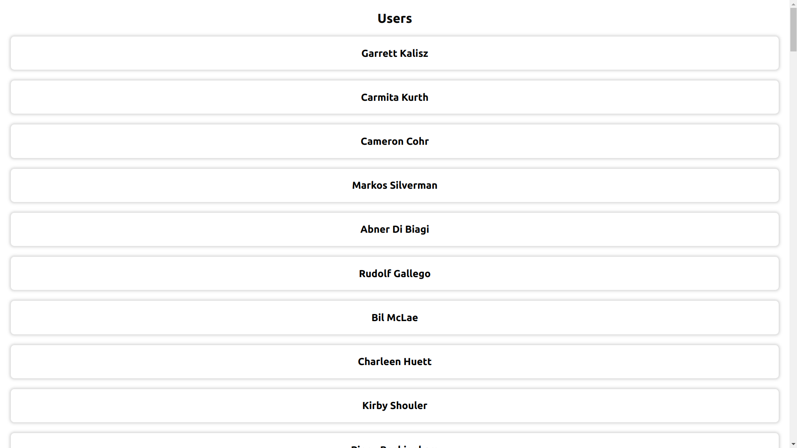

# User Activities Lister App using React and Typescript

## Get Started

- `yarn install` to install all dependencies
- `yarn start` to start the json-server on port 8000 and react server on port 3000 concurrently

## Features

- DateTimeGenerator used to generate random activity_periods for each user
- "React-Calendar" library for selecting dates
- Custom styling using StyledComponents library
- "Moment" library for parsing datetime
- Written in typescript
- Using "Concurrently" library to run both servers "concurrently"

## Screenshots

